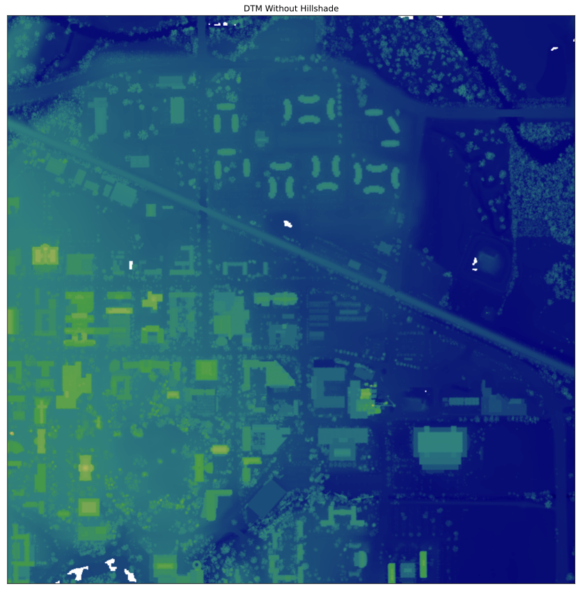
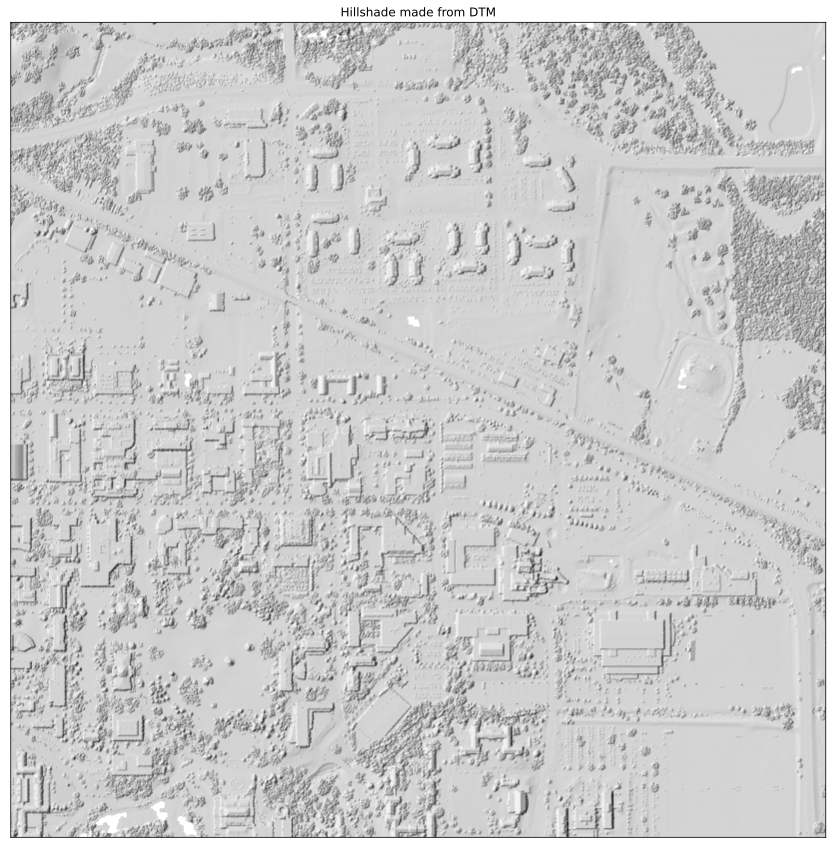
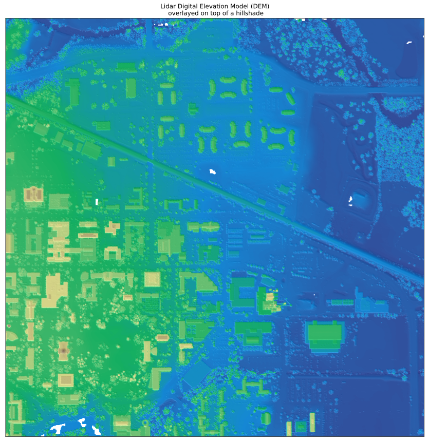

```python
import sys, os

sys.path.append(os.path.abspath(os.path.join('../')))
```


```python
# import the visualize module
from lidardataextractor.visualizer import visualize as viz

help(viz)
```

    Help on module lidardataextractor.visualizer.visualize in lidardataextractor.visualizer:
    
    NAME
        lidardataextractor.visualizer.visualize
    
    CLASSES
        builtins.object
            VisualizeRaster
        
        class VisualizeRaster(builtins.object)
         |  VisualizeRaster(data_file_path: str, shp_filepath: str) -> None
         |  
         |  A module to visualize the raster files
         |  
         |  Methods defined here:
         |  
         |  __init__(self, data_file_path: str, shp_filepath: str) -> None
         |      Initialize self.  See help(type(self)) for accurate signature.
         |  
         |  plot_3D_visualzation(self, s: float = 0.01, color: str = 'red')
         |      Plots a 3D terrain scatter plot of a geopandas dataframe
         |      
         |      Parameters:
         |      
         |          s (float, optional): S value. 
         |              (Default value = 0.01)
         |          color (str, optional): color of the points.
         |              (Default value = red)
         |      
         |      Returns:
         |      --------
         |      None
         |  
         |  plot_bands(self, hillshade: bool = False, azimuth: int = 150) -> None
         |      Parameters
         |      ----------
         |      hillshade:bool : option to plot hillshade over raster image
         |           (Default value = False)
         |      azimuth:int : The desired azimuth for the hillshade.
         |           (Default value = 150)
         |      
         |      Returns
         |      -------
         |      None
         |  
         |  plot_geodataframe(self, color: str = 'whitesmoke', edgecolor: str = 'red') -> None
         |      Plots a Geodataframe with columns such as geometry and elevation
         |      
         |      Parameters:
         |      -----
         |      color : color of the plotted image
         |          (Default value = whitesmoke)
         |      edgecolor : edgecolor of the plotted image
         |          (Default value = red)
         |      
         |      Returns:
         |      --------
         |      None
         |  
         |  plot_overlay(self) -> None
         |      Plot Overlays on the raster image
         |  
         |  ----------------------------------------------------------------------
         |  Data descriptors defined here:
         |  
         |  __dict__
         |      dictionary for instance variables (if defined)
         |  
         |  __weakref__
         |      list of weak references to the object (if defined)
    
    FILE
        /home/Abuton/Desktop/ML_PATH/week0/lidardataextractor/lidardataextractor/visualizer/visualize.py
    
    


```python
dir(viz)
```


    ['VisualizeRaster',
     '__builtins__',
     '__cached__',
     '__doc__',
     '__file__',
     '__loader__',
     '__name__',
     '__package__',
     '__spec__',
     'ep',
     'es',
     'gpd',
     'np',
     'plt',
     'rio',
     'warnings']


```python
# load the tif file to initialize the viz class
tif_filepath = "../data/IA_FullState.tif"
shp_filepath = "../shp/IA_FullState.shp"
vizuals = viz.VisualizeRaster(tif_filepath, shp_filepath)
```


```python
dir(vizuals)
```


    ['__class__',
     '__delattr__',
     '__dict__',
     '__dir__',
     '__doc__',
     '__eq__',
     '__format__',
     '__ge__',
     '__getattribute__',
     '__gt__',
     '__hash__',
     '__init__',
     '__init_subclass__',
     '__le__',
     '__lt__',
     '__module__',
     '__ne__',
     '__new__',
     '__reduce__',
     '__reduce_ex__',
     '__repr__',
     '__setattr__',
     '__sizeof__',
     '__str__',
     '__subclasshook__',
     '__weakref__',
     'elevation',
     'gdf',
     'plot_3D_visualzation',
     'plot_bands',
     'plot_geodataframe',
     'plot_overlay']


```python
# to get the elevations
vizuals.elevation
```


    masked_array(
      data=[[282.12, 284.25104183129275, 284.3559339981244, ...,
             275.01149812119115, 275.0102571245428, 275.00792566017253],
            [286.0537444379401, 282.36185326735136, 282.59, ...,
             274.94438151524287, 274.95, 275.0200634806837],
            [292.6812194694903, 288.13047692574787, 282.5872198260537, ...,
             274.96635271253217, 274.95, 275.03644630369314],
            ...,
            [301.1297859775241, 301.2892350802669, 302.3380339061729, ...,
             271.54130961156335, 271.4777341543034, 271.45],
            [298.6255717010057, 301.1581412311087, 301.2595908624526, ...,
             271.5739353769055, 271.5197328890062, 271.5066371810695],
            [291.5261230732481, 290.58, 301.24, ..., 271.58478585399337,
             271.55, 271.54999999999995]],
      mask=[[False, False, False, ..., False, False, False],
            [False, False, False, ..., False, False, False],
            [False, False, False, ..., False, False, False],
            ...,
            [False, False, False, ..., False, False, False],
            [False, False, False, ..., False, False, False],
            [False, False, False, ..., False, False, False]],
      fill_value=-9999.0)


```python
vizuals.gdf
```


    ['__class__',
     '__delattr__',
     '__dict__',
     '__dir__',
     '__doc__',
     '__eq__',
     '__format__',
     '__ge__',
     '__getattribute__',
     '__gt__',
     '__hash__',
     '__init__',
     '__init_subclass__',
     '__le__',
     '__lt__',
     '__module__',
     '__ne__',
     '__new__',
     '__reduce__',
     '__reduce_ex__',
     '__repr__',
     '__setattr__',
     '__sizeof__',
     '__str__',
     '__subclasshook__',
     '__weakref__',
     'elevation',
     'explore',
     'plot_bands',
     'plot_overlay']


```python
vizuals.plot_bands()
```


    

    


    <Figure size 432x288 with 0 Axes>


```python
vizuals.plot_bands(hillshade=True, azimuth=300)
```


    

    


    <Figure size 432x288 with 0 Axes>


```python
vizuals.plot_overlay()
```


    

    


    <Figure size 432x288 with 0 Axes>


```python
vizuals.plot_geodataframe()
```


```python
vizuals.plot_3D_visualzation()
```
